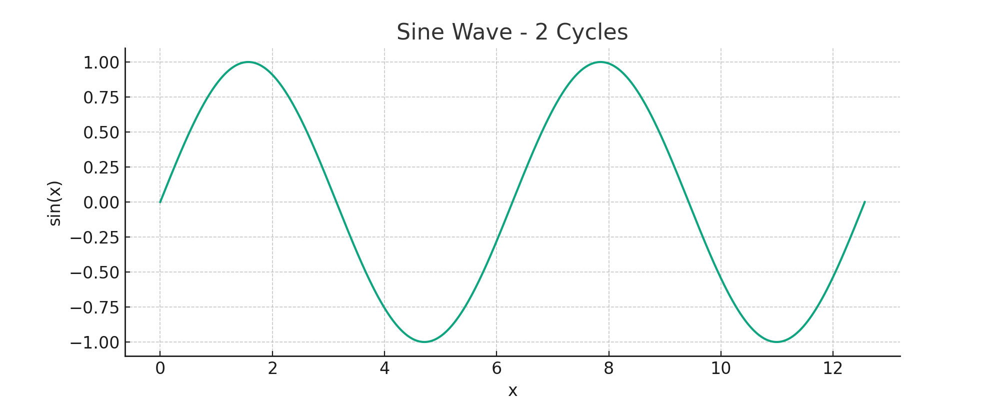
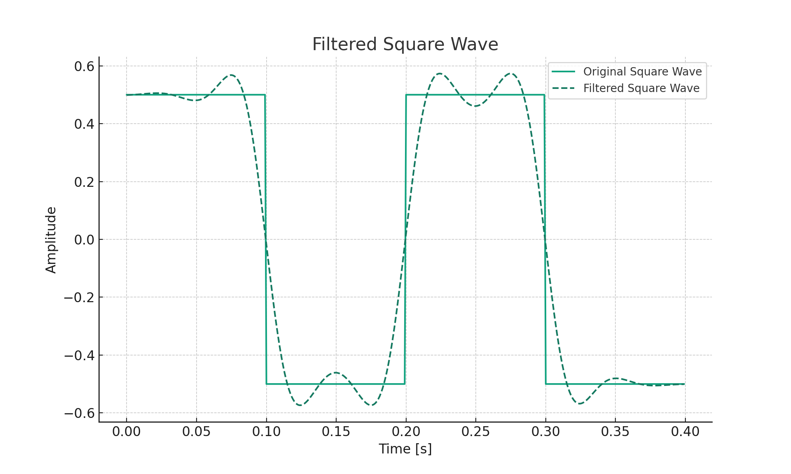

# Azure OpenAI Assistants demonstration

A sample of using an OpenAI Assistant to use the code interpreter to solve a maths problem. This is based on this [Learn](https://learn.microsoft.com/en-us/azure/ai-services/openai/how-to/assistant) documentation, but is a really simple maths problem.

This repo used the Visual Studio Code [REST client extension](https://github.com/Huachao/vscode-restclient) so that you can see the exact HTTP requests that go over the wire.

## The Scenario
This is a really simple maths problem of getting the square root of a number. Traditionally LLMs are not good at these problems. Assistants solve this by using some compute in a [sandboxed environment](https://learn.microsoft.com/en-us/azure/ai-services/openai/how-to/code-interpreter?tabs=python). This avoids issues of where an LLM could generate code that may be unsafe to run in a more conventional environment.

## Prerequisites
There are limits on the region's in which the assistants API is currently [deployed](https://learn.microsoft.com/en-us/answers/questions/1694320/assistants-is-only-available-in-the-following-regi). The example has been tested on Sweden Central.

The HTTP requests will need your Azure OpenAI resource name, key and the name of a model deployment. I suggest you use gpt-4o for this as this is the model that this has been tested against.

# Simple maths sample
This is a simple query to find the square root of a number you choose.

It is best to clone this repo and run inside Visual Studio code with the REST client.

Alternatively, if you can access GitHub CodeSpaces, that should work just as well.

[Requests.http](./requests.http)

## The Steps
The steps in this demo are marked in the requests.http file, but are described below in a little more detail.

1. STEP 1 - this creates the [assistant]([https://learn.microsoft.com/en-us/azure/ai-services/openai/assistants-reference?tabs=python#create-an-assistant](https://learn.microsoft.com/en-us/azure/ai-services/openai/assistants-reference?tabs=python#create-an-assistant)), gives it the instructions (AKA system prompt) and tells it to use the code interpreter. This returns an *assistant_id* which can be used later.
2. STEP 2 - this creates a [thread](https://learn.microsoft.com/en-us/azure/ai-services/openai/assistants-reference-threads?tabs=python), which is used to manage an overall conversation thread with the assistant.
3. STEP 3 - this creates a [message](https://learn.microsoft.com/en-us/azure/ai-services/openai/assistants-reference-messages?tabs=python#create-message) which is where we send the ask to the assistant. in this case "what is the square root of 16"
4.  STEP 4 - this [runs](https://learn.microsoft.com/en-us/azure/ai-services/openai/assistants-reference-runs?tabs=python#create-run) the thread. So now the assistant is attempting to ansswe the query.
5.  STEP 5 - [lists the messages](https://learn.microsoft.com/en-us/azure/ai-services/openai/assistants-reference-messages?tabs=python#list-messages) in the thread where we should see the LLM response in one of the messages. The response value is extracted to a variable *response* so you can see the text of the result of the query.
6.  STEP 6 - deletes the thread
7.  STEP 7 - deletes the assistant

# Generating a graph sample
To really show that the LLM isn't just retrieving ansswers from its training data, this question is a little more difficult.

"can you graph a sine wave of 1 peak to peak and show 2 cycles and return this as an image file"

In terms of steps, it is pretty similar to the first sample, but gets the generated file name and pulls back the contents of the file.

[SineWaveRequests.http](./sinewaverequests.http)

## Steps
The steps in this demo are marked in the sinewaverequests.http file, but are described below in a little more detail.

1. STEP 1 - this creates the [assistant]([https://learn.microsoft.com/en-us/azure/ai-services/openai/assistants-reference?tabs=python#create-an-assistant](https://learn.microsoft.com/en-us/azure/ai-services/openai/assistants-reference?tabs=python#create-an-assistant)), gives it the instructions (AKA system prompt) and tells it to use the code interpreter. This returns an *assistant_id* which can be used later.
2. STEP 2 - this creates a [thread](https://learn.microsoft.com/en-us/azure/ai-services/openai/assistants-reference-threads?tabs=python), which is used to manage an overall conversation thread with the assistant.
3. STEP 3 - this creates a [message](https://learn.microsoft.com/en-us/azure/ai-services/openai/assistants-reference-messages?tabs=python#create-message) which is where we send the ask to the assistant. in this case "what is the square root of 16"
4.  STEP 4 - this [runs](https://learn.microsoft.com/en-us/azure/ai-services/openai/assistants-reference-runs?tabs=python#create-run) the thread. So now the assistant is attempting to ansswe the query.
5.  STEP 5 - [lists the messages](https://learn.microsoft.com/en-us/azure/ai-services/openai/assistants-reference-messages?tabs=python#list-messages) in the thread where we should see the LLM response in one of the messages. The response has a file_id of a file that gets generated server side.
6.  STEP 6 - gets the [contents of the file](https://learn.microsoft.com/en-us/rest/api/azureopenai/files/get-content?view=rest-azureopenai-2024-05-01-preview&tabs=HTTP) this is an HTTP response. In the response pane you can save the contents of the file to your local PC and display


   
7.  STEP 7 - deletes the thread
8.  STEP 8 - deletes the assistant

# Another graph sample
Exactly the same steps above, but a different question:

```
can you graph a filtered square wave (where the filter is 4 times the frequency of the square wave) of 1 peak to peak and show 2 cycles and return this as an image file
```
If you then inspect the list of messages following the run, you can see how it approaches this:

> Sure! To achieve this, I will follow these steps
> 1. Create a square wave signal.
> 2. Design a low-pass filter with a cutoff frequency that is 4 times the frequency of the square wave.
> 3. Filter the square wave signal.
> 4. Plot the original and filtered square waves.
> 5. Save the plot as an image file.
>
> Let's start by writing the code to accomplish these steps.

This results in:


You can then ask what code it used to generate this:
```
can you show me they python coded to generate this image?
```
Of course! Here's the Python code used to generate the filtered square wave plot:
```
python
import numpy as np
import matplotlib.pyplot as plt
from scipy import signal
# Parameters
frequency = 5
# Frequency of the square wave (Hz)
sampling_rate = 1000
# Sampling rate (samples per second)
duration = 2 / frequency
# Duration to display (2 cycles)
amplitude = 0.5
# Amplitude of the square wave (peak-to-peak amplitude is 1)

# Time array
t = np.linspace(0, duration, int(sampling_rate * duration), endpoint=False)
# Create square wave
square_wave = amplitude * signal.square(2 * np.pi * frequency * t)
# Design a low-pass filter
cutoff_frequency = 4 * frequency
# Cutoff frequency (4 times the square wave frequency)
nyquist_rate = 0.5 * sampling_rate
normal_cutoff = cutoff_frequency / nyquist_rate
b, a = signal.butter(4, normal_cutoff, btype='low', analog=False)
# Apply the filter
filtered_square_wave = signal.filtfilt(b, a, square_wave)
# Plot the original and filtered square waves
plt.figure(figsize=(10, 6))
plt.plot(t, square_wave, label='Original Square Wave')
plt.plot(t, filtered_square_wave, label='Filtered Square Wave', linestyle='--')
plt.xlabel('Time [s]')
plt.ylabel('Amplitude')
plt.title('Filtered Square Wave')
plt.legend()
# Save the plot as an image file
file_path = '/mnt/data/filtered_square_wave.png'
plt.savefig(file_path)
plt.show()
```
This code creates a square wave, designs a low-pass filter with a cutoff frequency four times the square wave frequency, filters the square wave, and then plots and saves the graph as an image file.

